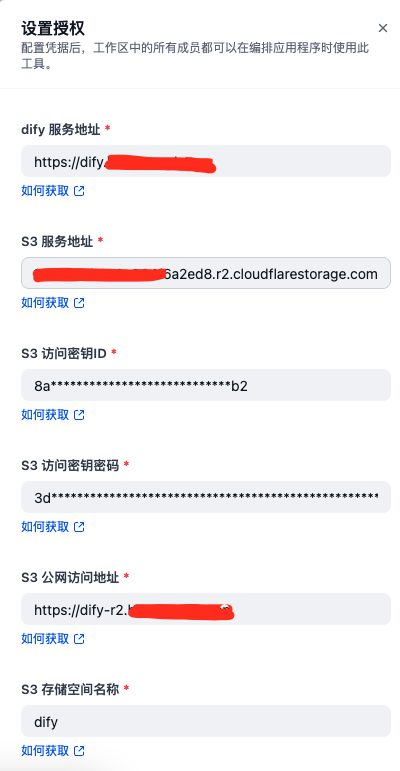

# botos3

**Author:** datoujiejie
**Version:** 0.0.1
**Type:** tool

# Description

## Overview

`botos3` is a dify plugin tool designed to streamline the process of uploading files to S3-compatible object storage services using the powerful `boto` library. Beyond just storage, this tool automatically generates and returns publicly accessible URLs for uploaded files, making it ideal for sharing and integrating with other systems.

This tool allows developers and teams to simplify file management workflows, ensuring efficient and secure interactions with S3 buckets.

## Features

1. Convenient file upload to S3-compatible object storage.
2. Automatic generation of public URLs for uploaded files.
3. Supports both file-based and base64-encoded uploads.

## Setup



## Available Tools

### 1. `s3_upload_file`

**Description:** Uploads a specified file to the configured S3 bucket and returns the public URL for the uploaded file.
**Parameters:**

- **File:** The file from dify.
- **File_URL:**  The file url.
- **S3 key:** The key (destination path) for the file in the S3 bucket. (required)


### 2. `s3_upload_base64`

**Description:** Uploads a base64-encoded object to the configured S3 bucket and returns its public URL. 
If base64 comes from the sandbox, you have to adjust the value of CODE_MAX_STRING_LENGTH

**Parameters:**

- **Base64 string:** The content in base64 format to be uploaded.(required)
- **S3 key:** The key (destination path) for the object in the S3 bucket.(required)

## Author


Created by [datoujiejie](https://github.com/datoujiejie)

## Repository


https://github.com/datoujiejie/dify-botos3-plugin

## Distribution / Export

### Manual Packaging

Run the packaging script to build a distributable zip (includes manifest and tool definitions):

```powershell
python build_package.py
```

The archive will appear under `dist/` as `botos3-<version>.zip`. (Version taken from `manifest.yaml`). Upload this zip in the Dify Marketplace submission flow or distribute internally.

### Automatic GitHub Release

This repository contains a GitHub Actions workflow at `.github/workflows/release-plugin.yml` which triggers on pushing a tag starting with `v` (e.g. `v0.0.4`). It:

1. Checks out code
2. Installs dependencies (if any in `requirements.txt`)
3. Runs `python build_package.py`
4. Uploads the zip as a build artifact
5. Publishes a GitHub Release attaching the packaged zip

To create a release:

```powershell
git tag v0.0.4
git push origin v0.0.4
```

Ensure you also bump the version field in `manifest.yaml` before tagging so the zip name aligns with the release tag.

### Updating Version

Edit `manifest.yaml` and change:

```yaml
version: 0.0.X
meta:
version: 0.0.X
```

Keep both `version` and `meta.version` in sync.

### Marketplace Notes

- Include `PRIVACY.md` content before publishing.
- Make sure icon file (`icon.svg`) is present.
- Keep your provider credentials description clear for end users.

### Recommended Next Steps

- Add unit tests (if feasible) before release.
- Add a CHANGELOG.md to track feature additions (download tools added in 0.0.3+).
- Consider semantic versioning: increment patch for fixes, minor for new tools, major for breaking changes.

